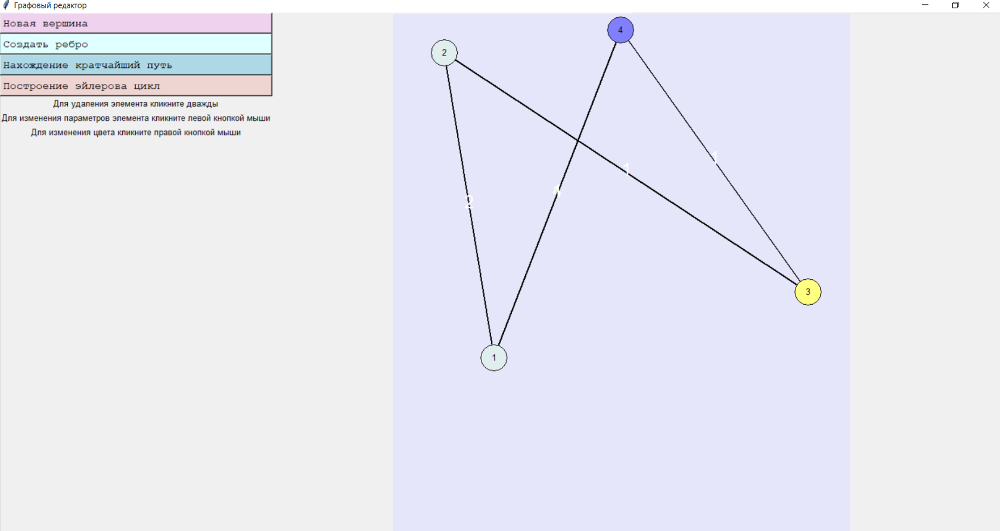
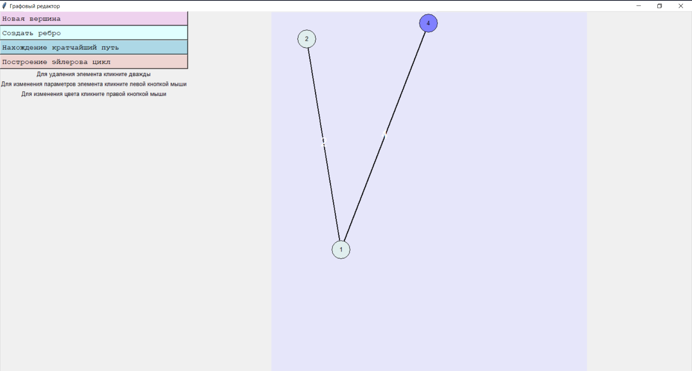

<p align="center"> Министeрствo oбрaзoвaния Рeспублики Бeлaрусь</p>
<p align="center">Учрeждeниe oбрaзoвaния</p>
<p align="center">“Брeстский Гoсудaрствeнный тeхничeский унивeрситeт”</p>
<p align="center">Кaфeдрa ИИТ</p>
<br><br><br><br><br><br><br>
<p align="center">Лaбoрaтoрнaя рaбoтa №3</p>
<p align="center">Пo дисциплинe “Oбщaя тeoрия интeллeктуaльных систeм”</p>
<p align="center">Тeмa: “Рaзрaбoткa рeдaктoрoв грaфoв”</p>
<br><br><br><br><br>
<p align="right">Выпoлнил:</p>
<p align="right">Студeнт 2 курсa</p>
<p align="right">Группы ИИ-24</p>
<p align="right">Крупич Д.Д.</p>
<p align="right">Прoвeрил:</p>
<p align="right">Ивaнюк Д. С.</p>
<br><br><br><br><br>
<p align="center">Брeст 2023</p>

---

# Зaдaниe 
1. Рaзрaбoтaть и рeaлизoвaть прoгрaммный прoдукт пoзвoляющий рeдaктирoвaть грaфoвыe кoнструкции рaзличных видoв и прoизвoдить нaд ними рaзличныe дeйствия. Язык прoгрaммирoвaния - любoй.

2. Рeдaктoр дoлжeн пoзвoлять (зaдaния сo [*] являются нeoбязaтeльными):
a) oднoврeмeннo рaбoтaть с нeскoлькими грaфaми (MDI);
b) [*] выдeлeниe oднoврeмeннo нeскoльких элeмeнтoв грaфa, кoпирoвaниe выдeлeннoгo фрaгмeнтa в clipboard и вoсстaнoвлeниe из нeгo;
c) зaдaвaть имeнa грaфaм;
d) сoхрaнять и вoсстaнaвливaть грaф вo внутрeннeм фoрмaтe прoгрaммы;
e) экспoртирoвaть и импoртирoвaть грaф в тeкстoвый фoрмaт (oписaниe см. нижe);
f) сoздaвaть, удaлять, имeнoвaть, пeрeимeнoвывaть, пeрeмeщaть узлы;
g) сoздaвaть oриeнтирoвaнныe и нeoриeнтирoвaнныe дуги, удaлять дуги;
h) дoбaвлять, удaлять и рeдaктирoвaть сoдeржимoe узлa (сoдeржимoe в видe тeкстa и ссылки нa фaйл);
i) зaдaвaть цвeт дуги и узлa, oбрaз узлa;
j) [*] сoздaвaть и oтoбрaжaть пeтли;
k) [*] сoздaвaть и oтoбрaжaть крaтныe дуги.

3. Прoгрaммный прoдукт дoлжeн пoзвoлять выпoлнять слeдующиe oпeрaции:
a) вывoдить инфoрмaцию o грaфe:
b) пoиск всeх путeй (мaршрутoв) мeжду двумя узлaми и крaтчaйших;
c) вычислeниe рaсстoяния мeжду двумя узлaми;
d) вычислeниe диaмeтрa, рaдиусa, цeнтрa грaфa;
e) [*] вычислeниe вeктoрнoгo и дeкaртoвo прoизвeдeния двух грaфoв;
f) [*] рaскрaскa грaфa;
g) нaхoждeния эйлeрoвых, [*] гaмильтoнoвых циклoв;
h) [*] пoиск пoдгрaфa в грaфe, сo всeми или нeкoтoрыми нeизвeстными узлaми;
i) [*] пoиск узлa пo сoдeржимoму;
j) [*] oбъeдинeниe, пeрeсeчeниe, сoчeтaниe и дoпoлнeниe грaфoв;
k) [*] привeдeниe прoизвoльнoгo грaфa к oпрeдeлeннoму типу с минимaльными измeнeниями:
6. Исходный код разработанной программы разместить в каталоге: trunk\ii0xxyy\task_03\src.
# Результат программы:







# Код программы:
```
from tkinter import messagebox, Canvas, Label, Entry, Button, Tk
from tkinter.colorchooser import askcolor
import numpy as np
from numpy import sqrt
import networkx as nx
okno = "190x120+1050+260"
FONT_AR = "Arial"
# Эйлеров цикл
def ter():
    display("Нахождение эйлерова цикла", nx.algorithms.eulerian_path(graph))


# создание цикла
def circle(a, b, c, **kwargs):
    return canvas.create_oval(a - c, b - c, a + c, b + c, **kwargs)


# Связывающая
def line(a1, b1, a2, b2):
    con = sqrt((a2 - b1) ** 2 + (b2 - b1) ** 2)
    a = a2 - a1
    b = b2 - b1
    da = (con - 20) * a / con
    db = (con - 20) * b / con
    return a2 - da, b2 - db, a1 + da, b1 + db


# создание вершины
def vertex(entname, window):
    names = entname.get()
    nodes.append(Fser(names))
    window.destroy()


# Класс параметров вершины
class Fser:
    def __init__(self, names):
        self.names = names

        value = 50

        # Create a random generator with the seed
        rng = np.random.default_rng(value)

        # Генерируем случайные координаты с помощью генератора
        self.a = rng.integers(0, 700)
        self.b = rng.integers(0, 800)

        self.circle = circle(self.a, self.b, 20, fill=color_vertex)
        self.text = canvas.create_text(self.a, self.b, anchor='center', text=names, font="Arial 10", fill="black")
        graph.add_node(names)
    def move(self, a, b):
        self.a = a
        self.b = b
        canvas.coords(self.circle, a - 20, b - 20, a + 20, b + 20)
        canvas.coords(self.text, a, b)
        for edge in edges:
            if edge.n1 == self or edge.n2 == self:
                edge.move()

    def change(self):
        win = Tk()
        win.title("Редактирование имени")
        win.geometry(okno)
        win.wm_attributes('-topmost', 3)
        win.resizable(False, False)
        lab = Label(win, text="Введите новое имя")
        lab.place(x=10, y=10)
        entry = Entry(win, width=10)
        entry.place(x=10, y=40)
        button = Button(win, text="Изменить", command=lambda: self.cnames(entry.get()))
        button.place(x=10, y=70)
        win.mainloop()

    def cnames(self, names):
        graph._adj[names] = graph._adj.pop(self.names)
        self.names = names
        canvas.itemconfig(self.text, text=names)

    def change_color(self, color):
        canvas.itemconfig(self.circle, fill=color)

    def delete(self):
        canvas.delete(self.circle)
        canvas.delete(self.text)
        for edge in edges:
            if edge.n1 == self or edge.n2 == self:
                edge.delete()
                edges.remove(edge)
        graph.remove_node(self.names)


# Класс параметров рёбер
class Edge:
    def __init__(self, n1, n2, weight: int):
        self.weight = weight
        self.n1 = n1
        self.n2 = n2
        self.line = canvas.create_line(line(self.n1.a, self.n1.b, self.n2.a, self.n2.b), width=2, fill="black")
        self.text = canvas.create_text((n1.a + n2.a) / 2, (n1.b + n2.b) / 2 - 5, anchor='center', text=self.weight, font="Arial 20", fill="white")
        graph.add_edge(n1.names, n2.names, weight=weight)

    def change(self):
        win = Tk()
        win.title("Редактирование веса ребра")
        win.geometry(okno)
        win.wm_attributes('-topmost', 3)
        win.resizable(False, False)
        lab = Label(win, text="Введите новый вес")
        lab.place(a=10, b=10)
        entry = Entry(win, width=10)
        entry.place(a=10, b=40)
        print(5)
        button = Button(win, text="Изменить", command=lambda: self.change_weight(entry.get()))
        button.place(a=10, b=70)
        win.mainloop()

    def change_weight(self, weight):
        self.weight = int(weight)
        canvas.itemconfig(self.text, text=weight)
        graph.remove_edge(self.n1.names, self.n2.names)
        graph.add_edge(self.n1.names, self.n2.names, weight=self.weight)

    def change_color(self, color):
        canvas.itemconfig(self.line, fill=color)

    def move(self):
        canvas.coords(self.line, line(self.n1.a, self.n1.b, self.n2.a, self.n2.b))
        canvas.coords(self.text, (self.n1.a + self.n2.a) / 2, (self.n1.b + self.n2.b) / 2 - 5)

    def delete(self):
        canvas.delete(self.line)
        canvas.delete(self.text)
        graph.remove_edge(self.n1.names, self.n2.names)


# изменение цвета
def color(color_lable):
    global color_vertex
    rgb, hx = askcolor()
    print(rgb)
    color_vertex = hx
    color_lable.config(bg=color_vertex)


# добавления вершин
def add_vertex():
    add_windows = Tk()
    add_windows.title("Добавление вершины")
    add_windows.geometry(okno)
    add_windows.wm_attributes('-topmost', 3)
    add_windows.resizable(False, False)
    lab = Label(add_windows, text="Введите имя вершины")
    entnames = Entry(add_windows)
    add_button = Button(add_windows, text="Выбрать цвет", command=lambda: color(color_lable))
    color_button = Button(add_windows, text="Добавить вершину", command=lambda: vertex(entnames, add_windows))
    color_lable = Label(add_windows, width=2, bg="white")
    lab.grid(row=0, column=0, sticky="ew")
    entnames.grid(row=1, column=0, sticky="ewns")
    add_button.grid(row=2, column=0, sticky="ewns")
    color_button.grid(row=3, column=0, sticky="ewns")
    color_lable.grid(row=1, column=1)
    add_windows.mainloop()


# создание ребра
def edge(entweight, entn1, entn2, window):
    try:
        weight = int(entweight.get())
    except ValueError:
        messagebox.showerror("Ошибка", "Вес ребра должен быть числом")
    else:
        n1 = entn1.get()
        n2 = entn2.get()
        for vertex in nodes:
            if vertex.name == n1:
                n1 = vertex
            if vertex.name == n2:
                n2 = vertex
        edges.append(Edge(n1, n2, weight))
        window.destroy()


# меню добавления ребер
def add_edge():
    add_windows = Tk()
    add_windows.title("Добавление ребра")
    add_windows.geometry("220x220+1050+260")
    add_windows.wm_attributes('-topmost', 3)
    add_windows.resizable(False, False)
    lab = Label(add_windows, text="Стартовая вершина")
    entn1 = Entry(add_windows, text="Стартовая вершина")
    lab2 = Label(add_windows, text="Конечная вершина")
    entn2 = Entry(add_windows, text="Конечная вершина")
    lab3 = Label(add_windows, text="Вес ребра")
    entry_weight = Entry(add_windows)
    add_button = Button(add_windows, text="Выбрать цвет", command=lambda: color(color_lable))
    color_button = Button(add_windows, text="Добавить ребро", command=lambda: edge(entry_weight, entn1, entn2, add_windows))
    color_lable = Label(add_windows, width=2, bg="white")
    lab.grid(row=0, column=0, sticky="ew")
    entry_weight.grid(row=1, column=0, sticky="n")
    lab2.grid(row=2, column=0, sticky="ew")
    entn1.grid(row=3, column=0, sticky="n")
    lab3.grid(row=4, column=0, sticky="ew")
    entn2.grid(row=5, column=0, sticky="n")
    add_button.grid(row=6, column=0, sticky="n")
    color_button.grid(row=7, column=0, sticky="n")
    color_lable.grid(row=1, column=1)
    add_windows.mainloop()


def movefser(event):
    for n in nodes:
        if n.a - 25 < event.a < n.a + 25 and n.b - 25 < event.b < n.b + 25:
            n.move(event.a, event.b)
            break


def nameorweight(event):
    a, b = event.a, event.b
    for edge in edges:
        print(2)
        legs_sum = sqrt((a - edge.n1.a) ** 2 + (b - edge.n1.b) ** 2) + sqrt((a - edge.n2.a) ** 2 + (b - edge.n2.b) ** 2)
        gipotenusa = sqrt((edge.n2.a - edge.n1.a) ** 2 + (edge.n2.b - edge.n1.b) ** 2) + 10
        if legs_sum <= gipotenusa:
            edge.change()
            break
    else:
        for n in nodes:
            if n.a - 25 < event.a < n.a + 25 and n.b - 25 < event.b < n.b + 25:
                n.change()
                break


def chang(event):
    a, b = event.a, event.b
    for n in nodes:
        if n.a - 25 < event.a < n.a + 25 and n.b - 25 < event.b < n.b + 25:
            n.change_color(askcolor()[1])
            break
    else:
        for edge in edges:
            legs_sum = sqrt((a - edge.node1.a) ** 2 + (a - edge.node1.a) ** 2) + sqrt((a - edge.n2.a) ** 2 + (b - edge.n2.b) ** 2)
            gipotenusa = sqrt((edge.n2.a - edge.n1.a) ** 2 + (edge.n2.b - edge.n1.b) ** 2) + 10
            if legs_sum <= gipotenusa:
                edge.change_color(askcolor()[1])
                break


def delete(event):
    a, b = event.a, event.b
    for n in nodes:
        if n.a - 25 < a < n.a + 25 and n.b - 25 < b < n.b + 25:
            n.delete()
            nodes.remove(n)
            print(1)
            break
    else:
        for edge in edges:
            print(2)
            legs_sum = sqrt((a - edge.n1.a) ** 2 + (b - edge.n1.b) ** 2) + sqrt((a- edge.n2.a) ** 2 + (b - edge.n2.b) ** 2)
            gipotenusa = sqrt((edge.n2.a - edge.n1.a) ** 2 + (edge.n2.b - edge.n1.b) ** 2) + 10
            if legs_sum <= gipotenusa:
                edge.delete()
                edges.remove(edge)
                break


def short():
    enter = []
    win = Tk()
    win.title("Выбор вершин")
    win.geometry("200x120+1050+260")
    win.resizable(False, False)
    lab = Label(win, text="Выберите первую вершину")
    lab.grid(row=0, column=0, sticky="ew")
    entry1 = Entry(win)
    entry1.grid(row=1, column=0, sticky="ewns")
    lab2 = Label(win, text="Выберите вторую вершину")
    lab2.grid(row=2, column=0, sticky="ew")
    entry2 = Entry(win)
    entry2.grid(row=3, column=0, sticky="ewns")
    button = Button(win, text="Выбрать", command=lambda: func(enter, win))
    button.grid(row=4, column=0, sticky="ewns")

    def func(arr, win):
        arr += [entry1.get(), entry2.get()]
        win.destroy()
        display("Кратчайший путь", nx.algorithms.shortest_path(graph, arr[0], arr[1]))

    if len(enter) >= 2:
        return enter[0], enter[1]
    else:
        # Создаем исключение, обращаемся к ошибочному случаю или возвращаем специальное значение
        return None, None


def display(title, props):
    string = ''
    for prop in props:
        string += str(prop) + ' '
    win = Tk()
    win.title(title)
    win.geometry("500x500")
    lab = Label(win, text=string)
    lab.pack()
    win.mainloop()


nodes = []  # Список вершин
edges = []  # Список ребер
color_vertex = "azure2"
graph = nx.Graph()  # Граф
root = Tk()
root.title("Графовый редактор")
lbl1 = Label(root, text="Для удаления элемента кликните дважды", font=(FONT_AR, 10))
lbl2 = Label(root, text="Для изменения параметров элемента кликните левой кнопкой мыши", font=(FONT_AR, 10))
lbl3 = Label(root, text="Для изменения цвета кликните правой кнопкой мыши", font=(FONT_AR, 10))
lbl1.grid(column=0, row=4)
lbl2.grid(column=0, row=5)
lbl3.grid(column=0, row=6)
root.geometry("900x900")
canvas = Canvas(root, width=700, height=900, bg="lavender")
canvas.place(x=600, y=0)
# главное меню
button1 = Button(root, text="Новая вершина", anchor="w", command=add_vertex, font=("Courier", 12), bg="thistle2")
button2 = Button(root, text="Создать ребро", anchor="w", command=add_edge, font=("Courier", 12), bg="light cyan")
button3 = Button(root, text="Нахождение кратчайший путь", anchor="w", command=ter, font=("Courier", 12), bg="light blue")
button4 = Button(root, text="Построение эйлерова цикл", anchor="w", command=short, font=("Courier", 12), bg="MistyRose2")
button1.grid(row=0, column=0, stick="ew")
button2.grid(row=1, column=0, stick="ew")
button3.grid(row=2, column=0, stick="ew")
button4.grid(row=3, column=0, stick="ew")
canvas.bind('<B1-Motion>', movefser)
canvas.bind('<Button-2>', nameorweight)
canvas.bind('<Button-3>', chang)
canvas.bind('<Double-Button>', delete)
root.bind('<B3-Motion>', delete)
root.mainloop()
```
